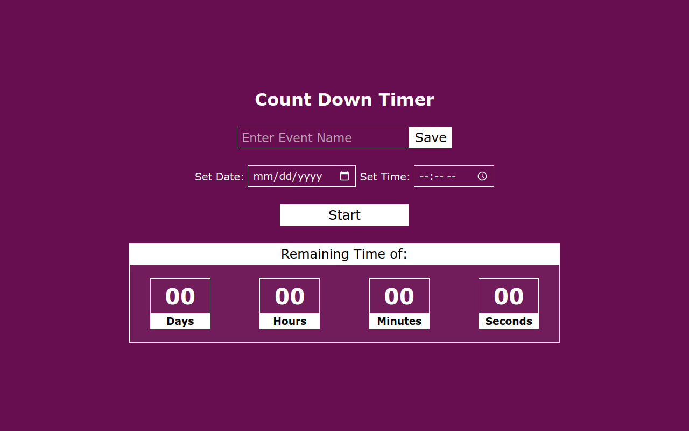

# Countdown Timer Web App

## Overview

Welcome to the Countdown Timer Web App project! This app is designed to inform users about the time remaining until an upcoming event. Built with HTML, CSS, and JavaScript, the project showcases the power of DOM manipulation. Users can also input the name of the upcoming event for a personalized countdown experience.

### Table of Contents

- [Installation](#installation)
- [How to use](#how-to-use)
- [Technologies Used](#technologies-used)
- [Features](#features)
- [Project Structure](#project-structure)
- [Credits](#credits)
- [License](#license)



## Installation

To run this project locally, follow these steps:

1. Clone the repository to your local machine.
    ```bash
    git clone https://github.com/ramzancodeclub/Count-Down-Timer.git
    ```

2. Open the project folder in your code editor.

3. Open the `index.html` file in your web browser.

## How to Use

To use the Countdown Timer Web App:

1. Open the [live demo](https://count-down-timer-chi.vercel.app/) or run it locally.

2. Enter the name of the upcoming event in the provided input field and click save button.

3. Set the date and time for the event using the date and time pickers.

4. Click the "Start" button to begin the countdown.

5. Witness the real-time countdown to your upcoming event.

## Technologies Used

- HTML
- CSS
- JavaScript (DOM manipulation)

## Features

- **Countdown Timer:** Displays the time remaining until the specified event.

- **Event Name Input:** Allows users to input the name of the upcoming event for a personalized touch.

- **User-Friendly Interface:** Simple design for ease of use.

- **Responsive:** Responsive design for various screen sizes.

## Project Structure

The project is structured for easy navigation, featuring a clean and responsive design.

## Credits

- [Muhammad Ramzan](https://github.com/ramzancodeclub) - Project Creator

## License

This project is licensed under the [MIT License](LICENSE). Feel free to use and modify the code as per the license terms.

## Badges


## How to Contribute

If you'd like to contribute to the project, follow these steps:

1. Fork the project.
2. Create a new branch for your feature: `git checkout -b feature-name`.
3. Commit your changes: `git commit -m 'Add new feature'`.
4. Push to the branch: `git push origin feature-name`.
5. Open a pull request.

## Contact

If you have any questions, suggestions, or just want to connect, feel free to reach out:

- Email: [ramzancodeclub@gmail.com](ramzancodeclub@gmail.com)
- Portfolio: [muhammad-ramzan.vercel.app](https://muhammad-ramzan.vercel.app/)
- LinkedIn: [in/ramzancodeclub](https://www.linkedin.com/in/ramzancodeclub/)

## Tests

The project includes a set of tests to ensure the functionality is working as expected. To run the tests, use the following command:
```bash
npm test
```
Happy counting down!
